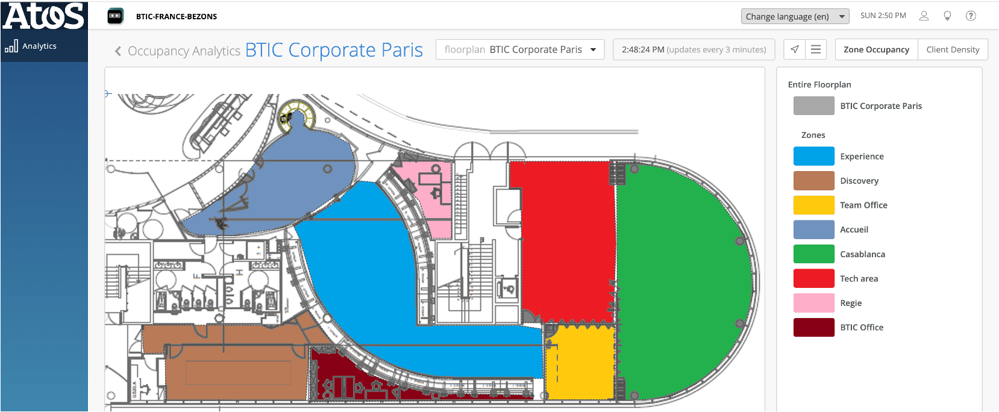

# Federated Learning for Occupancy Prediction  
**Highly-Imbalanced · Non-IID · Low-Volume IoT Logs**

[](#license)
[](#requirements)

> **Paper:** S. Solat & N. Georgantas,  
> *Federated Learning for Occupancy Prediction with Highly Imbalanced, Non-IID, Low-Volume Data* (CoopIS 2025)

---

## 1. Overview
This repository contains the full data-engineering and **federated-learning (FL)** pipeline described in the paper above.  
It forecasts the number of connected devices (a proxy for human presence) in eight building zones while keeping raw data **on-premise**.

* **Data challenges:** extreme sparsity and imbalance, short history, strong non-IID behaviour between zones.  
* **Key ideas:** focal-MSE / Huber / Pinball losses, dynamic FedProx aggregation, synthetic data expansion, seasonal drift correction.  
* **Outcome:** correlations ≥ 0.85 on 6 / 8 zones and < 7 % absolute load error in the busiest areas—without centralising any raw logs.

---

## 2. Repository layout

```text
github_repository/
├── federated_learning/
│   ├── server_coordinator.py
│   ├── client_train_val_test.py
│   ├── client_inference.py
│   └── all_zones.yaml
├── helpers_for-data-engineering/
│   ├── restore_missing_rows.py
│   ├── synthetic_generator.py
│   ├── patterns.py
│   ├── add_column.py
│   └── utils.py          # (optional) shared helpers
└── zones_datasets/
    ├── Accueil_dataset.xlsx
    ├── BTIC_Office_dataset.xlsx
    ├── Casablanca_dataset.xlsx
    ├── Discovery_dataset.xlsx
    ├── Experience_dataset.xlsx
    ├── Regie_dataset.xlsx
    ├── Team_Office_dataset.xlsx
    ├── Tech_Area_dataset.xlsx
    └── Zone_heatmap.csv   # raw Juniper export
```

---

## Floor-plan (BTIC Corporate Paris)




